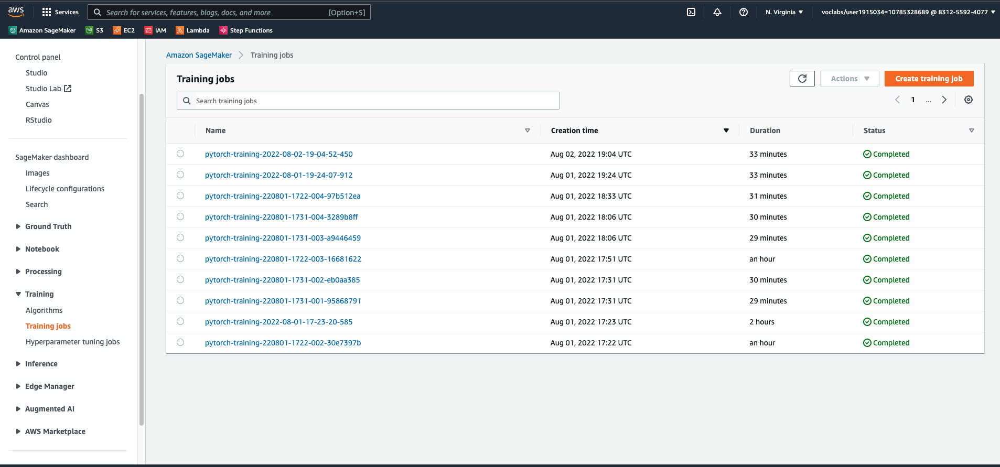
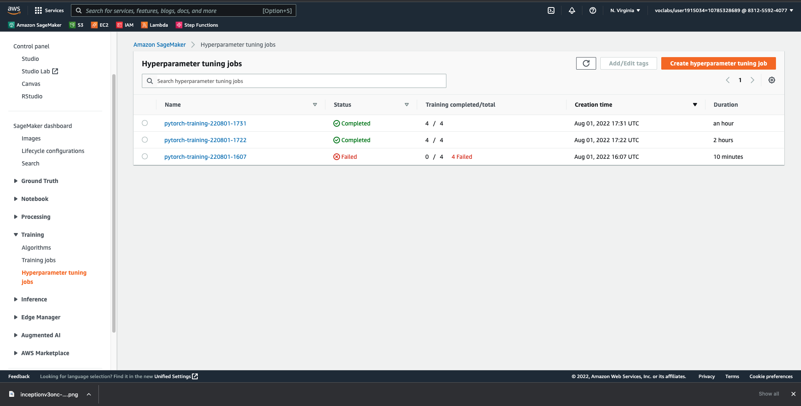
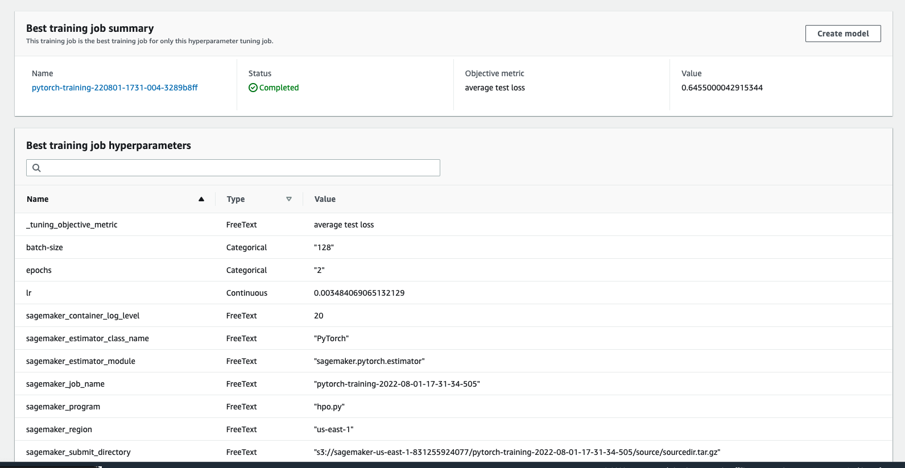
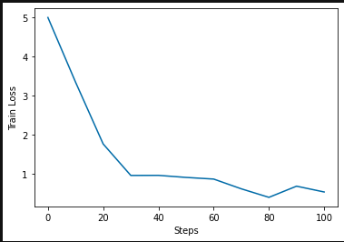
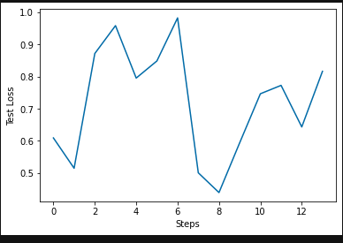
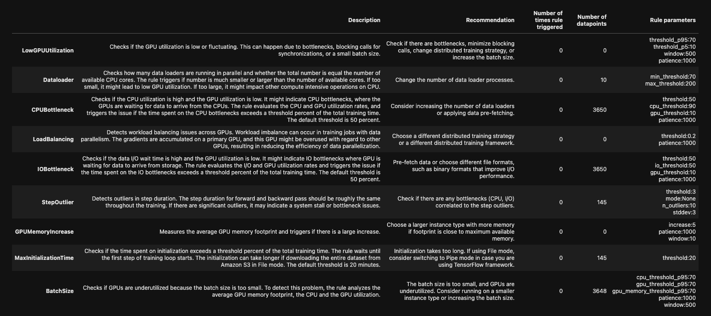
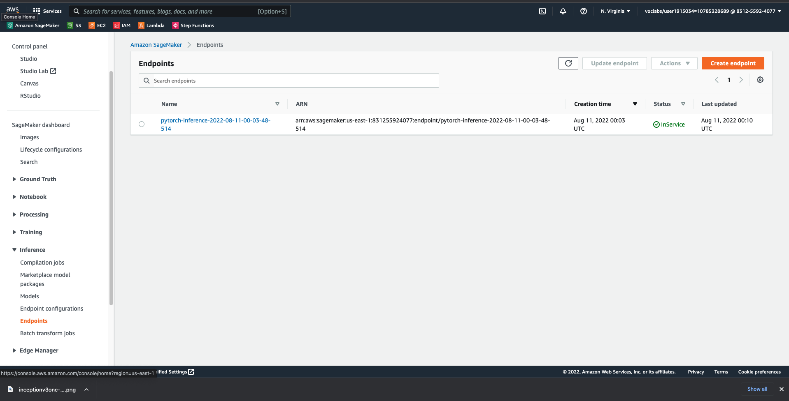

# Image Classification using AWS SageMaker

Use AWS Sagemaker to train a pretrained model that can perform image classification by using the Sagemaker profiling, debugger, hyperparameter tuning and other good ML engineering practices. This can be done on either the provided dog breed classication data set or one of your choice.

## Project Set Up and Installation
Enter AWS through the gateway in the course and open SageMaker Studio. 
Download the starter files.
Download/Make the dataset available. 

## Dataset
The provided dataset is the dogbreed classification dataset which can be found in the classroom.
The project is designed to be dataset independent so if there is a dataset that is more interesting or relevant to your work, you are welcome to use it to complete the project.

### Access
Upload the data to an S3 bucket through the AWS Gateway so that SageMaker has access to the data. 

## Hyperparameter Tuning

- The pre-trained model that I chose for this project was Inception v3. This is an image recognition model that has been shown to attain greater than 78.1% accuracy on the ImageNet dataset. The model is the culmination of many ideas developed by multiple researchers over the years. It is based on the original paper: ["Rethinking the Inception Architecture for Computer Vision"](https://arxiv.org/abs/1512.00567) by Szegedy, et. al.
- The model itself is made up of symmetric and asymmetric building blocks, including convolutions, average pooling, max pooling, concatenations, dropouts, and fully connected layers. Batch normalization is used extensively throughout the model and applied to activation inputs. Loss is computed using Softmax.

A high-level diagram of the model is shown in the following screenshot:

- The following hyperparameters were selected for tuning: 
    - **Learning rate** - learning rate defines how fast the model trains. A large learning rate allows the model to learn faster, with a small learning rate it takes a longer time for the model to learn but with more accuracy. The range is from 0.001 to 0.1.

    - **Batch size** - batch size is the number of examples from the training dataset used in the estimate of the error gradient. Batch size controls the accuracy of the estimate of the error gradient when training neural networks. The batch-size we choose between two numbers 64 and 128.

    - **epoch** - epochs is the number of times that the learning algorithm will work through the entire training dataset. The epochs we choose between two numbers 2 and 5.

- The best hyperparameters selected were: {'batch-size': '128', 'lr': '0.003484069065132129', 'epochs': '2'}

### All Training Jobs

### Hyperparameters Tuning Jobs

### Best Hyperparameters Tuning Job

## Debugging and Profiling
### Debugging Report
Two plots show dependence between loss and step: first one shows the `train_loss/steps`, the second one shows the `test_loss/steps`.
### Train loss plot:

### Test loss plot:

### Debugging and Profile Rules:

### Profiling Results:

### Results
As we see there are some anomalous behaviour in the debugging output:
1. In the `train_loss/steps` as steps are increased the loss is decreased. The graph is smooth.
2. In the `test_loss/steps` as steps are increased we cannot say the loss is decreased. The graph isn't smooth.

Also noticed that: 
- No rules were triggered during the process
- The average step duration was 13.1s 

Here are some ways that may help to fix the anomalous behaviour seen:
1. Adding more hyperparameters to tune.
2. Increasing hyperparameter ranges for hpo tuning.
3. Increasing `max_jobs` for hpo tuning.
4. Adding more Fully Connected layers to the pretrained model.

## Model Deployment
The model is deployed using `inference.py` script.

### Deployed the Endpoint

### Instructions on how to Query the Endpoint with a Sample Input
* The dog images I use must be downloaded from [here](https://s3-us-west-1.amazonaws.com/udacity-aind/dog-project/dogImages.zip).
* Test images I use are stored in the `dogImages/test/` folder.
* Scripts to predict on the Endpoint:
	* store image path in `image_path`
	* prepare image and store it as `payload`:
	    `response = object.get()`
		`payload = response['Body'].read()`
	* run prediction:
		`response = predictor.predict(payload, initial_args={"ContentType": "image/jpeg"})`
		`response= json.loads(response.decode())`
		`predicted_dog_breed_idx = np.argmax(response,1)[0]`

### Test prediction
In `train_and_deploy.ipynb` I run 4 test predictions, and the predictions are pretty accurate.

Here is an example of a prediction:

### Endpoint Instance Metrics

### Endpoint Invocation Metrics

